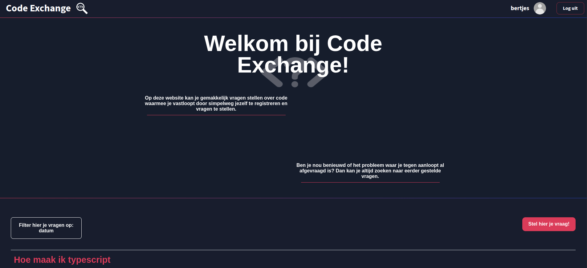
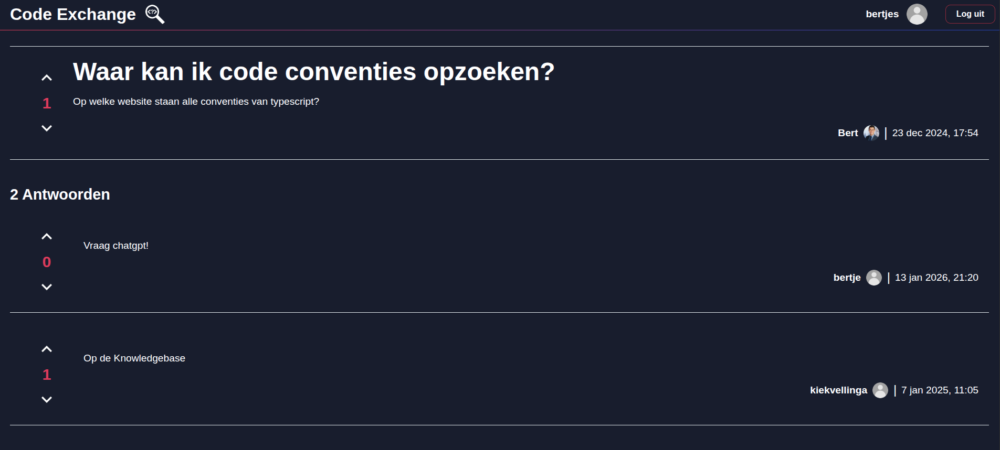

# Code Exchange

A full-stack Q&A forum web application built entirely in TypeScript, inspired by platforms like Stack Overflow.




## About

Code Exchange was developed collaboratively with a classmate as part of our HBO-ICT Software Engineering program (Block 2). The app lets users register accounts, post coding questions with embedded code snippets, answer each other's questions, and rate both questions and answers with an upvote/downvote system.

Questions can be tagged with a programming language and filtered by date, expertise level, or whether they have answers. The frontend uses Vite as a build tool with libraries like Marked and EasyMDE for markdown support and Highlight.js for syntax highlighting. All data is persisted through a relational SQL database accessed via the HBO-ICT Cloud API.

**Live demo:** [forum-sigma-one.vercel.app](https://forum-sigma-one.vercel.app)

## Features

- User registration and session-based authentication
- Post coding questions with embedded code snippets
- Answer questions and rate both questions and answers (upvote/downvote)
- Tag questions with a programming language
- Filter by date, expertise level, or answer status
- Markdown support with syntax highlighting
- MVC architecture pattern

## Tech Stack

| Layer | Technology |
|-------|-----------|
| Language | TypeScript |
| Build Tool | Vite |
| Markdown | Marked, EasyMDE |
| Syntax Highlighting | Highlight.js |
| Database | SQL (HBO-ICT Cloud API) |
| Styling | CSS |

## Getting Started

### Prerequisites

- [Visual Studio Code](https://code.visualstudio.com/)
- [Node.js](https://nodejs.org/) (version `20.x.x`)
- [Git](https://git-scm.com/)

### Recommended VS Code Extensions

- [ESLint](https://marketplace.visualstudio.com/items?itemName=dbaeumer.vscode-eslint)
- [EditorConfig](https://marketplace.visualstudio.com/items?itemName=editorconfig.editorconfig)

### Installation

```bash
git clone https://github.com/MEvan774/Forum.git
cd Forum
npm install
npm run dev
```

The app will be available at `http://127.0.0.1:3000`. Changes are hot-reloaded via Vite.

## Project Structure

```
Forum/
├── src/           # Application source code
├── wwwroot/       # Static files and index.html
├── docs/          # Project documentation
├── vite.config.ts # Vite build configuration
├── tsconfig.json  # TypeScript configuration
└── package.json
```

## What I Learned

- MVC pattern implementation in a web application
- Session-based authentication and user management
- Collaborative Git workflows and code reviews
- Iterating on UI through guerrilla user testing
- Working with relational databases via API layers

## Documentation

See the [docs folder](docs/index.md) for technical and process documentation.
