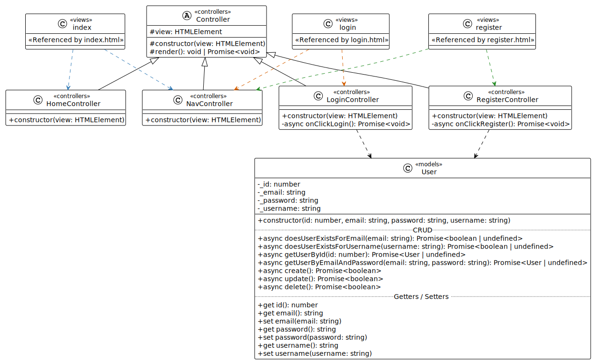

# Class Diagram
Voor de User Stories "Inloggen" en "Registreren" is een Class Diagram opgesteld hoe je deze functionaliteit in een MVC-structuur kunt opzetten.

> **Tip!** Klik met de rechter muisknop op de afbeelding en open deze in een apart tabblad!

Korte uitleg van wat je hierboven ziet:

- Het gedeelte bovende naam van een Class in de vorm van `<<naam>>` is de naam van de map waar dit Class zou moeten staan. Zo zie je dat je dus in principe drie mappen in je `src`-map zou moeten hebben: `models`, `views` en `controllers` (MVC-structuur).

- In je `wwwroot`-map zou je een `index.html`, `login.html` en `register.html` moeten hebben die respectievelijk dus `/src/views/index.ts`, `/src/views/login.ts` en `/src/views/register.ts` inladen via een `script`-tag.

- Het is de bedoeling dat je alle Classes **exact** namaakt zoals ze in de Class Diagram beschreven staan, inclusief de naamgeving! 

- Elke Class heeft zijn eigen bestand, bijvoorbeeld de Class `HomeController` zit dus in het bestand `src/controllers/HomeController.ts`.
  
Overige punten van aandacht:

- De Class `Controller` is een abstracte klasse die als basis geldt voor al je controllers. Deze hoef je niet direct aan het begin van het project te maken en over te erven (*inheritance*), maar het kan je wel wat werk in de toekomst schelen.

- Hoewel een Class Diagram geen implementatie details beschrijft, kan je deze vaak wel afleiden. Wat je echter niet kun zien is hoe de `render`-methode werkt. Roep als onderdeel van je `constructor` altijd de `this.render()` methode aan (of `void this.render()` als de `render`-methode als `async` is aangemerkt).
